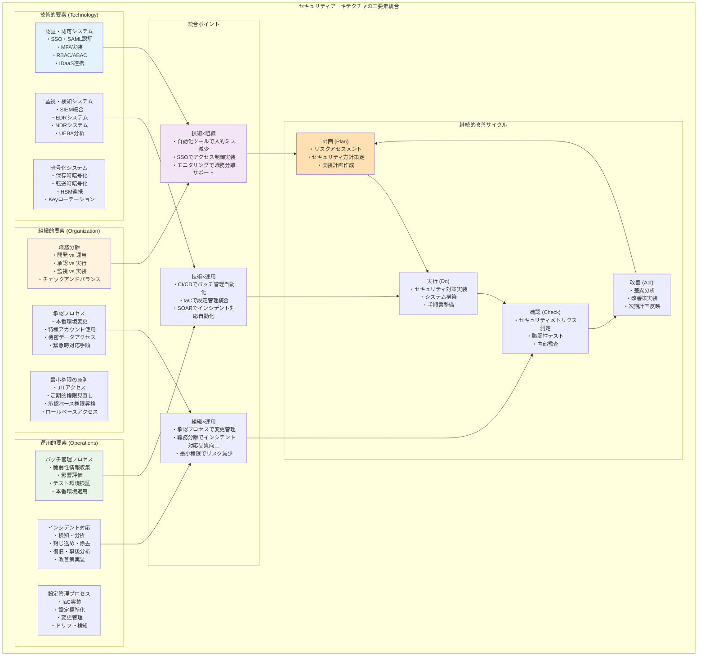

# 第2章：インフラエンジニアのためのセキュリティ設計

> **この章で学ぶこと**
> - 多層防御アーキテクチャの設計方法を理解する
> - インフラエンジニアが担うセキュリティの役割を明確にする
> - セキュリティフレームワークの実装アプローチを学ぶ
> - 実務で使える設計原則と判断基準を身につける

[第1章](../chapter-chapter01/index.md)でセキュリティの基礎概念を学びました。この章では、それらの概念をインフラエンジニアの視点から実際のシステム設計にどう適用するかを理解していきます。単一の対策に依存せず、複数の防御層を組み合わせることで、堅牢なセキュリティアーキテクチャを構築する方法を学びます。

## 2.1 多層防御の設計原理

多層防御（Defense in Depth）は、城郭の防御システムから発想を得たセキュリティ設計の基本原理です。一つの防御策が破られても、他の防御層が攻撃を阻止できるよう、複数の防御メカニズムを重層的に配置します。この概念をITインフラに適用することで、単一の脆弱性や設定ミスが致命的な被害につながることを防げます。

### 城郭防御システムから学ぶ設計思想

中世ヨーロッパの城郭は、多層防御の優れた例です。最外郭の城壁、堀、跳ね橋、門の監視、内郭の防御、最後の砦である天守閣と、段階的に防御レベルが高まる構造になっています。攻撃者は各段階で時間と労力を消費し、防御側はその間に対策を講じることができます。

この設計思想をITインフラに適用すると、以下のような防御層が考えられます。


**外郭防御層**：ファイアウォール、IDS/IPS、WAFなど、外部からの攻撃を最初に迎撃する層です。大量の攻撃トラフィックを識別・遮断し、明らかに悪意のあるアクセスを排除します。

**境界防御層**：DMZ設計、ネットワークセグメンテーション、プロキシサーバなど、内部ネットワークへの侵入を制御する層です。必要最小限の通信のみを許可し、不正なネットワーク移動を防ぎます。

**内部防御層**：アクセス制御、特権管理、暗号化など、内部システムでの不正アクセスを防ぐ層です。正当なユーザーの権限昇格攻撃や横方向への攻撃拡散を阻止します。

**データ防御層**：データベースセキュリティ、暗号化、バックアップなど、最終的に保護すべき情報資産を守る層です。データが抽出されても機密性を保ち、破壊されても復旧できる仕組みを提供します。

### 防御層間の相互連携設計

多層防御の効果を最大化するためには、各防御層が独立して機能するだけでなく、相互に連携することが重要です。ある層で検知された脅威情報を他の層で活用し、組織的な防御反応を実現します。

**脅威インテリジェンスの共有**：外郭防御層で検知された攻撃パターンを内部防御層に伝達し、類似の攻撃に対する警戒レベルを高めます。例えば、ファイアウォールで特定の送信元IPからの攻撃を検知した場合、内部システムでもそのIPからのアクセスを重点的に監視します。

**段階的対応の自動化**：各層での検知結果に基づいて、後続の防御層が自動的に対応レベルを調整します。軽微な異常では警告レベルで監視を強化し、深刻な脅威では即座に遮断やアクセス制限を実行します。

**フェイルセーフ設計の実装**：一つの防御層が機能停止した場合でも、他の層が代替機能を提供できるよう設計します。主要なファイアウォールが停止した場合でも、バックアップファイアウォールや内部セグメント防御が最低限の保護を維持します。

### インフラエンジニアの視点から見た実装優先度

限られたリソースで多層防御を実装する際は、ビジネス価値とリスクレベルに基づいた優先度設定が重要です。

**第1優先：クリティカルパスの保護**
組織の中核業務に直結するシステムとデータフローを最優先で保護します。ECサイトの決済処理、顧客データベース、財務システムなど、停止や侵害が直接的な事業損失につながる要素に集中的な防御を配置します。

具体的には、データベースサーバへの直接アクセス経路の制限、重要なAPIエンドポイントの保護、決済処理フローでのデータ検証強化などを実装します。また、これらのシステムには冗長化とバックアップを必須とし、単一障害点を排除します。

**第2優先：攻撃経路の遮断** 
攻撃者が内部システムに到達しやすい経路を特定し、その遮断に焦点を当てます。外部接続ポイント、特権アカウント、管理インターフェースなど、攻撃の起点になりやすい要素を重点的に保護します。

実装例として、管理用ネットワークの物理的分離、VPNアクセスの多要素認証必須化、踏み台サーバによるアクセス制御、管理者アカウントの定期的なローテーションなどがあります。

**第3優先：検知・対応力の強化**
完全な侵入防止は困難であることを前提とし、早期検知と迅速な対応能力の構築に投資します。ログ集約・分析基盤、インシデント対応手順、復旧メカニズムなどを整備します。

技術的実装として、SIEM（Security Information and Event Management）システムの導入、ネットワークトラフィックの行動分析、異常検知アルゴリズムの活用、自動化されたインシデント対応フローの構築などを行います。

この優先度に基づく実装アプローチは[第3章のセキュリティ要件設計](../chapter-chapter03/index.md#リスクベースアプローチによる実装優先度)で詳細に解説します。

```mermaid
flowchart LR
    subgraph "実装優先度フレームワーク"
        subgraph "第1優先：クリティカルパスの保護"
            CriticalAssets["重要資産の特定<br/>・顧客データベース<br/>・決済システム<br/>・核心業務API"]
            CriticalProtection["重点的防御実装<br/>・DB暗号化<br/>・APIゲートウェイ<br/>・冗長化構成"]
            CriticalMonitoring["専用監視<br/>・リアルタイムアラート<br/>・異常検知<br/>・迅速対応"]
        end
        
        subgraph "第2優先：攻撃経路の遮断"
            AttackVectors["攻撃ベクター分析<br/>・外部接続ポイント<br/>・特権アカウント<br/>・管理インターフェース"]
            PathBlocking["経路遮断実装<br/>・ファイアウォール強化<br/>・VPN多要素認証<br/>・踏み台サーバー"]
            AccessRestriction["アクセス制御<br/>・管理ネットワーク分離<br/>・時間制限アクセス<br/>・承認フロー"]
        end
        
        subgraph "第3優先：検知・対応力強化"
            DetectionCapability["検知能力構築<br/>・SIEMシステム<br/>・行動分析<br/>・MLベース異常検知"]
            ResponseCapability["対応能力構築<br/>・SOARシステム<br/>・プレイブック作成<br/>・自動対応"]
            RecoveryCapability["復旧能力構築<br/>・スナップショットバックアップ<br/>・DRサイト<br/>・復旧手順自動化"]
        end
        
        subgraph "成熟度レベル"
            Level1["レベル1：基本的防御<br/>・ファイアウォール<br/>・ウイルス対策<br/>・パッチ管理"]
            Level2["レベル2：管理された防御<br/>・アクセス制御<br/>・監視システム<br/>・インシデント対応"]
            Level3["レベル3：定義された防御<br/>・リスクベース管理<br/>・継続的監視<br/>・予防的対策"]
            Level4["レベル4：適応的防御<br/>・脅威インテリジェンス<br/>・自動対応<br/>・進化する防御"]
            Level5["レベル5：最適化された防御<br/>・予測的防御<br/>・AIベース異常検知<br/>・自律的セキュリティ"]
        end
        
        subgraph "リソース配分戦略"
            Budget["予算制約<br/>・初期投資<br/>・運用コスト<br/>・ROI計算"]
            Workforce["人的リソース<br/>・スキルレベル<br/>・教育コスト<br/>・外部パートナー"]
            Technology["技術スタック<br/>・既存インフラ<br/>・統合要件<br/>・技術的互換性"]
        end
        
        CriticalAssets --> CriticalProtection
        CriticalProtection --> CriticalMonitoring
        
        AttackVectors --> PathBlocking
        PathBlocking --> AccessRestriction
        
        DetectionCapability --> ResponseCapability
        ResponseCapability --> RecoveryCapability
        
        Level1 --> Level2
        Level2 --> Level3
        Level3 --> Level4
        Level4 --> Level5
        
        Budget --> CriticalAssets
        Workforce --> AttackVectors
        Technology --> DetectionCapability
        
        CriticalMonitoring -.> AttackVectors
        AccessRestriction -.> DetectionCapability
    end
    
    style CriticalAssets fill:#ffebee
    style AttackVectors fill:#fff3e0
    style DetectionCapability fill:#e8f5e8
    style Level5 fill:#e3f2fd
    style Budget fill:#f3e5f5
```

## 2.2 セキュリティアーキテクチャの構成要素

効果的なセキュリティアーキテクチャは、技術的要素、組織的要素、運用的要素の三つの側面が調和して機能します。インフラエンジニアはこれらの要素を総合的に理解し、バランスの取れた設計を行う必要があります。

### 技術的要素：システムレベルの実装

技術的要素は、システムそのものに実装されるセキュリティ機能です。これらは主に自動化された保護メカニズムとして機能し、人的介入なしに一定レベルの防御を提供します。

**認証・認可システム**は、「誰が」「何に」「どの程度」アクセスできるかを制御する仕組みです。単一サインオン（SSO）による利便性向上と、多要素認証（MFA）によるセキュリティ強化を両立させる設計が求められます。また、ロールベースアクセス制御（RBAC）により、職務に応じた適切な権限管理を実現します。

実装時の重要な考慮点として、認証強度の段階的適用があります。公開情報へのアクセスには単一要素認証、機密情報には多要素認証、特権操作には追加の承認プロセスを要求するなど、リスクレベルに応じた適応的な認証を設計します。

**暗号化システム**は、データの機密性を技術的に保護する仕組みです。保存時暗号化（Encryption at Rest）と転送時暗号化（Encryption in Transit）、および処理時暗号化（Encryption in Use）を適切に組み合わせることで、データライフサイクル全体での保護を実現します。暗号鍵の管理も重要な要素で、HSM（Hardware Security Module）やクラウドキー管理サービスの活用を検討します。

暗号化の実装では、性能への影響を最小限に抑えることが重要です。データの重要度に応じて暗号化レベルを調整し、必要最小限の暗号化で最大の保護効果を得る設計を心がけます。

**監視・検知システム**は、異常な活動を自動的に識別し、早期警告を提供する仕組みです。SIEM（Security Information and Event Management）による統合ログ管理、EDR（Endpoint Detection and Response）による端末監視、NDR（Network Detection and Response）によるネットワーク監視を組み合わせた包括的な監視体制を構築します。

監視システムの設計では、誤検知（False Positive）と見逃し（False Negative）のバランスを取ることが重要です。厳密すぎる設定は運用負荷を増加させ、緩すぎる設定は真の脅威を見逃すリスクがあります。継続的なチューニングにより、実運用に適した検知精度を維持します。

### 組織的要素：人とプロセスの管理

技術的対策だけでは完全なセキュリティは実現できません。人間の行動とプロセスの管理が、セキュリティアーキテクチャの重要な構成要素となります。

**職務分離（Separation of Duties）**は、重要な作業を複数の人員で分担することで、内部不正や人的ミスを防ぐ仕組みです。例えば、システム開発者が本番環境への直接的なアクセス権限を持たず、運用チームが承認とデプロイを担当するという分離が考えられます。

実装における重要な考慮点は、職務分離と業務効率のバランスです。過度な分離は業務速度を低下させ、開発チームの生産性を損なう可能性があります。リスクレベルに応じた適切な分離レベルを設定し、自動化ツールを活用して分離による負荷を軽減します。

**最小権限の原則（Principle of Least Privilege）**は、各ユーザーが職務遂行に必要最小限の権限のみを持つよう制限する原則です。定期的な権限見直しプロセスと組み合わせることで、権限の蓄積を防ぎ、内部脅威のリスクを最小化します。

技術的な実装として、時限的権限付与（Just-in-Time Access）や承認ベースの権限昇格（Privilege Escalation）を導入し、必要な時にのみ必要な権限を付与する仕組みを構築します。

**承認プロセス**は、重要な変更や操作に対して事前承認を求める仕組みです。本番環境への変更、特権アカウントの使用、機密データへのアクセスなど、リスクの高い活動に対して適切なチェック機能を組み込みます。

承認プロセスの設計では、緊急時対応との両立も重要です。セキュリティインシデントや重大な障害発生時には、通常の承認プロセスを迂回できる緊急手順を用意し、事後承認による透明性確保を行います。

### 運用的要素：継続的な維持管理

セキュリティアーキテクチャは一度構築すれば終わりではなく、継続的な維持管理が必要です。脅威環境の変化、技術の進歩、組織の成長に対応し続ける運用的要素が重要です。

**パッチ管理プロセス**は、システムの脆弱性を継続的に修正する仕組みです。脆弱性情報の収集、影響評価、テスト環境での検証、本番環境への適用という一連のプロセスを標準化し、迅速かつ安全なパッチ適用を実現します。

**設定管理プロセス**は、システム設定の一貫性と正確性を維持する仕組みです。Infrastructure as Code（IaC）の活用により、設定の自動化と標準化を図り、人的ミスによる設定誤りを防ぎます。また、設定変更の履歴管理により、問題発生時の迅速な原因特定と復旧を可能にします。

**インシデント対応プロセス**は、セキュリティ事象発生時の組織的対応を定義した仕組みです。検知、分析、封じ込め、根絶、復旧、事後分析の各段階で、役割分担と手順を明確化し、迅速で効果的な対応を実現します。

これらの運用的要素は[第8章の継続的セキュリティ運用](../chapter-chapter08/index.md#soc-security-operations-center-の設計と構築)で詳細に解説します。



## 2.3 インフラエンジニアの役割と責任範囲

現代のITインフラにおいて、インフラエンジニアが担うセキュリティの役割は多岐にわたります。単なる技術的実装者ではなく、セキュリティアーキテクチャの設計者、運用の実践者、そして組織のセキュリティ文化の推進者としての役割を理解することが重要です。

### セキュリティアーキテクト機能

インフラエンジニアは、組織のセキュリティアーキテクチャを設計・実装する中核的な役割を担います。この役割には、技術的な専門知識だけでなく、ビジネス要件とセキュリティ要件のバランスを取る判断力が必要です。

**要件分析と設計判断**：ビジネス要件、コンプライアンス要件、技術的制約を総合的に分析し、最適なセキュリティアーキテクチャを設計します。例えば、新しいWebアプリケーションをデプロイする際に、パフォーマンス要件を満たしながら、OWASP Top 10の脅威に対する適切な保護を実装する設計を行います。

**技術選定と統合設計**：多様なセキュリティ製品やクラウドサービスの中から、組織に最適なソリューションを選定し、既存システムとの統合を設計します。単一ベンダーの製品で統一するか、ベストオブブリードで組み合わせるかの判断も含まれます。

**標準化とガイドライン策定**：セキュリティ設定の標準化、セキュアな構成のテンプレート化、設計ガイドラインの策定を行います。これにより、組織全体でのセキュリティレベルの一貫性を確保し、属人的な判断によるばらつきを防ぎます。

### システムインテグレータ機能

複数のシステムコンポーネントを統合し、全体として一貫したセキュリティ機能を実現する役割です。各システムが個別に高いセキュリティレベルを持っていても、統合時に新たな脆弱性が生じる可能性があるため、この役割が重要になります。

**システム間連携の設計**：異なるシステム間でのデータ交換、認証情報の共有、ログ情報の統合などを安全に実現する設計を行います。マイクロサービスアーキテクチャにおけるサービス間通信の暗号化や、API Gateway を通じたアクセス制御などが具体例です。

**セキュリティツールチェーンの構築**：開発から運用まで、各段階でのセキュリティツールを適切に統合し、自動化されたセキュリティパイプラインを構築します。脆弱性スキャン、静的・動的解析、コンプライアンスチェックなどを CI/CD プロセスに組み込みます。

**レガシーシステムとの統合**：新しいセキュリティ機能を既存のレガシーシステムと安全に統合する方法を設計します。段階的移行計画の策定、ブリッジソリューションの活用、リスク軽減策の実装などを含みます。

### 運用リーダー機能

日常的なセキュリティ運用を牽引し、組織のセキュリティ成熟度を継続的に向上させる役割です。技術的なスキルに加えて、チームマネジメントや組織横断的な調整能力が求められます。

**セキュリティ運用の標準化**：監視手順、インシデント対応手順、変更管理手順などを標準化し、チーム全体での一貫した運用を実現します。また、新規メンバーの教育プログラムを策定し、技術的な知識とセキュリティ意識の両面での育成を行います。

**メトリクス管理と改善提案**：セキュリティ運用の効果を定量的に測定し、継続的な改善提案を行います。インシデント対応時間、脆弱性修正期間、コンプライアンス遵守率などのKPIを設定し、データドリブンな運用改善を推進します。

**組織横断的な連携推進**：開発チーム、運用チーム、ビジネス部門、監査部門など、様々なステークホルダーとの連携を推進します。セキュリティ要件を各部門が理解しやすい形で伝達し、協力的なセキュリティ文化の構築に貢献します。

### 責任範囲の明確化と境界管理

インフラエンジニアの責任範囲を明確にし、他の役割との境界を適切に管理することで、セキュリティギャップの発生を防ぎます。

**技術的責任範囲**：ネットワークセキュリティ、サーバセキュリティ、クラウドセキュリティ、インフラ監視など、インフラレイヤーでのセキュリティ実装と運用に責任を持ちます。

**協働責任範囲**：アプリケーションセキュリティ、データセキュリティ、エンドポイントセキュリティなど、開発チームや他のセキュリティ専門チームと協働して取り組む領域を明確にします。

**サポート責任範囲**：ユーザー教育、ポリシー策定、コンプライアンス対応など、セキュリティ専門部門や法務部門が主導し、インフラエンジニアがサポートする領域を定義します。

この責任範囲の明確化により、組織全体でのセキュリティガバナンスが向上し、効率的なセキュリティ管理が可能になります。

```mermaid
flowchart TB
    subgraph "インフラエンジニアのセキュリティ役割と責任範囲"
        subgraph "セキュリティアーキテクト機能"
            RequirementAnalysis["要件分析・設計判断<br/>・ビジネス要件分析<br/>・コンプライアンス要件理解<br/>・技術的制約考慮<br/>・パフォーマンスバランス"]
            TechSelection["技術選定・統合設計<br/>・セキュリティ製品選定<br/>・クラウドサービス選択<br/>・ベストオブブリード判断<br/>・統合アーキテクチャ設計"]
            Standardization["標準化・ガイドライン策定<br/>・セキュリティ設定標準化<br/>・セキュア構成テンプレート<br/>・設計ガイドライン作成<br/>・ベストプラクティス策定"]
        end
        
        subgraph "システムインテグレータ機能"
            SystemIntegration["システム間連携設計<br/>・異システム間データ交換<br/>・認証情報共有<br/>・ログ情報統合<br/>・APIゲートウェイ設計"]
            ToolChain["セキュリティツールチェーン<br/>・開発～運用統合<br/>・脆弱性スキャン統合<br/>・静的・動的解析<br/>・CI/CDパイプライン統合"]
            LegacyIntegration["レガシーシステム統合<br/>・段階的移行計画<br/>・ブリッジソリューション<br/>・リスク軽減策<br/>・合併プラン"]
        end
        
        subgraph "運用リーダー機能"
            OperationStandardization["セキュリティ運用標準化<br/>・監視手順策定<br/>・インシデント対応手順<br/>・変更管理手順<br/>・教育プログラム"]
            MetricsManagement["メトリクス管理・改善提案<br/>・KPI設定・測定<br/>・インシデント対応時間<br/>・脆弱性修正期間<br/>・データドリブン改善"]
            CrossTeamCoordination["組織横断連携推進<br/>・開発チーム連携<br/>・ビジネス部門連携<br/>・監査部門連携<br/>・セキュリティ文化構築"]
        end
        
        subgraph "責任範囲の分類"
            TechnicalResponsibility["技術的責任範囲<br/>・ネットワークセキュリティ<br/>・サーバセキュリティ<br/>・クラウドセキュリティ<br/>・インフラ監視"]
            CollaborativeResponsibility["協働責任範囲<br/>・アプリケーションセキュリティ<br/>・データセキュリティ<br/>・エンドポイントセキュリティ<br/>・DevSecOps"]
            SupportResponsibility["サポート責任範囲<br/>・ユーザー教育サポート<br/>・ポリシー策定サポート<br/>・コンプライアンス対応<br/>・リスクアセスメント"]
        end
        
        subgraph "スキルマトリックス"
            TechnicalSkills["技術スキル<br/>・ネットワークアーキテクチャ<br/>・クラウドプラットフォーム<br/>・セキュリティツール<br/>・コンテナ技術"]
            ManagementSkills["マネジメントスキル<br/>・プロジェクト管理<br/>・リスク管理<br/>・チームマネジメント<br/>・ステークホルダー管理"]
            CommunicationSkills["コミュニケーションスキル<br/>・技術的内容の平易化<br/>・ステークホルダー対応<br/>・ドキュメント作成<br/>・プレゼンテーション"]
        end
        
        subgraph "キャリアパス"
            Junior["ジュニアレベル<br/>(～2年)<br/>・基本的セキュリティ設定<br/>・ガイドライン遵守<br/>・監視ツール操作"]
            Mid["ミドルレベル<br/>(2～5年)<br/>・セキュリティ設計<br/>・インシデント対応<br/>・ツール選定"]
            Senior["シニアレベル<br/>(5～10年)<br/>・アーキテクチャ設計<br/>・リスク管理<br/>・チームリード"]
            Expert["エキスパートレベル<br/>(10年～)<br/>・戦略的計画<br/>・組織変革<br/>・業界リーダーシップ"]
        end
        
        RequirementAnalysis --> TechnicalResponsibility
        SystemIntegration --> CollaborativeResponsibility
        OperationStandardization --> SupportResponsibility
        
        TechnicalSkills --> Junior
        ManagementSkills --> Mid
        CommunicationSkills --> Senior
        TechnicalSkills --> Expert
        ManagementSkills --> Expert
        CommunicationSkills --> Expert
        
        Junior --> Mid
        Mid --> Senior
        Senior --> Expert
        
        TechnicalResponsibility -.> TechnicalSkills
        CollaborativeResponsibility -.> ManagementSkills
        SupportResponsibility -.> CommunicationSkills
    end
    
    style RequirementAnalysis fill:#e3f2fd
    style SystemIntegration fill:#fff3e0
    style OperationStandardization fill:#e8f5e8
    style TechnicalResponsibility fill:#f3e5f5
    style Expert fill:#ffe0b2
```

## 2.4 セキュリティフレームワークの実装アプローチ

セキュリティフレームワークは、組織のセキュリティ活動を体系的に管理するためのガイドラインです。インフラエンジニアにとって重要なのは、これらのフレームワークを理論として理解するだけでなく、実際のシステム設計と運用にどう適用するかを理解することです。

### NIST Cybersecurity Frameworkの実践的活用

NIST Cybersecurity Framework（NIST CSF）は、「識別（Identify）」「保護（Protect）」「検知（Detect）」「対応（Respond）」「復旧（Recover）」の5つの機能で構成される包括的なフレームワークです。

**識別（Identify）機能の実装**：
資産管理台帳の整備、リスクアセスメントの実施、ガバナンス体制の確立を行います。インフラエンジニアの視点では、管理対象システムの棚卸し、依存関係の可視化、重要度分類の実施が含まれます。

具体的には、CMDB（Configuration Management Database）を活用したIT資産の一元管理、ネットワーク図の作成と維持、データフロー図の整備などを通じて、保護すべき資産とその関係性を明確にします。

**保護（Protect）機能の実装**：
アクセス制御、データセキュリティ、保護技術の実装を行います。インフラレベルでは、IAM（Identity and Access Management）の実装、暗号化の適用、セキュリティ設定の標準化などが中心となります。

例えば、ゼロトラストアーキテクチャの段階的導入、暗号化ポリシーの策定と実装、セキュリティ設定のベースライン定義などを通じて、包括的な保護機能を構築します。

**検知（Detect）機能の実装**：
継続的監視体制の構築、異常検知システムの導入、セキュリティイベントの分析能力の向上を図ります。SIEM、UEBA（User and Entity Behavior Analytics）、脅威インテリジェンス活用などが含まれます。

**対応（Respond）機能の実装**：
インシデント対応計画の策定、対応チームの編成、通信手順の整備を行います。技術的には、インシデント対応の自動化、証拠保全システム、復旧手順の準備などが重要です。

**復旧（Recover）機能の実装**：
復旧計画の策定、バックアップシステムの整備、継続的改善プロセスの確立を行います。災害復旧（DR）とビジネス継続（BC）の観点から、技術的・組織的な復旧能力を構築します。

### ISO27001/27002の実装戦略

ISO27001は情報セキュリティマネジメントシステム（ISMS）の認証規格で、ISO27002は具体的な管理策を定義した規格です。これらを実装する際は、組織の規模と成熟度に応じた段階的アプローチが効果的です。

**フェーズ1：基盤整備**
情報セキュリティポリシーの策定、資産管理体制の確立、リスクマネジメントプロセスの導入を行います。インフラエンジニアの観点では、技術的な管理策の現状評価と改善計画の策定が中心となります。

**フェーズ2：技術的管理策の実装**
アクセス制御（A.9）、暗号化（A.10）、システムセキュリティ（A.12）、通信セキュリティ（A.13）など、インフラに直接関連する管理策を優先的に実装します。

**フェーズ3：運用的管理策の強化**
インシデント管理（A.16）、事業継続（A.17）、監査（A.18）など、継続的な運用に関わる管理策を整備します。

**フェーズ4：継続的改善**
定期的な内部監査、マネジメントレビュー、改善活動を通じて、ISMS の継続的な向上を図ります。

### クラウド環境でのフレームワーク適用

クラウド環境では、責任共有モデルの理解が重要です。クラウドプロバイダーとユーザーの責任範囲を明確にし、適切な管理策を実装する必要があります。

**IaaS環境での適用**：
ユーザーはゲストOS以上のセキュリティに責任を持ちます。OS設定、アプリケーション設定、データ保護、ネットワーク設定などを適切に管理する必要があります。

**PaaS環境での適用**：
ユーザーはアプリケーションコードとデータの保護に集中できますが、プラットフォーム設定の理解も重要です。API設定、権限管理、ログ設定などに注意を払います。

**SaaS環境での適用**：
ユーザー管理、アクセス制御、データ分類などが主な責任範囲となります。SaaSベンダーのセキュリティレポートを定期的に確認し、適切な設定管理を行います。

これらのクラウドセキュリティの詳細は[第6章のクラウドセキュリティ](../chapter-chapter06/index.md)で解説します。

```mermaid
flowchart TD
    subgraph "セキュリティフレームワークの実装アプローチ"
        subgraph "NIST Cybersecurity Framework 実装"
            Identify["識別 (Identify)<br/>・CMDB構築<br/>・ネットワーク図作成<br/>・データフロー図整備<br/>・重要度分類"]
            Protect["保護 (Protect)<br/>・IAM実装<br/>・暗号化適用<br/>・Zero Trust導入<br/>・ベースライン定義"]
            Detect["検知 (Detect)<br/>・SIEMシステム<br/>・UEBA分析<br/>・脅威インテリジェンス<br/>・異常検知"]
            Respond["対応 (Respond)<br/>・インシデント対応計画<br/>・SOAR自動化<br/>・証拠保全<br/>・コミュニケーション"]
            Recover["復旧 (Recover)<br/>・DRサイト<br/>・バックアップシステム<br/>・BC計画<br/>・復旧手順"]
        end
        
        subgraph "ISO27001/27002 実装戦略"
            Phase1["フェーズ1：基盤整備<br/>・情報セキュリティポリシー<br/>・資産管理体制<br/>・リスクマネジメント<br/>・現状評価"]
            Phase2["フェーズ2：技術的管理策<br/>・アクセス制御(A.9)<br/>・暗号化(A.10)<br/>・システムセキュリティ(A.12)<br/>・通信セキュリティ(A.13)"]
            Phase3["フェーズ3：運用的管理策<br/>・インシデント管理(A.16)<br/>・事業継続(A.17)<br/>・監査(A.18)<br/>・コンプライアンス"]
            Phase4["フェーズ4：継続的改善<br/>・定期的内部監査<br/>・マネジメントレビュー<br/>・改善活動<br/>・ISMS向上"]
        end
        
        subgraph "クラウド環境でのフレームワーク適用"
            IaaS["アイアース(IaaS)<br/>・OS以上の管理責任<br/>・ゲストOS設定<br/>・アプリケーション設定<br/>・ネットワーク設定"]
            PaaS["プラットフォーム(PaaS)<br/>・アプリケーション管理<br/>・API設定<br/>・権限管理<br/>・ログ設定"]
            SaaS["サービス(SaaS)<br/>・ユーザー管理<br/>・アクセス制御<br/>・データ分類<br/>・ベンダー管理"]
        end
        
        subgraph "責任共有モデル"
            CloudProvider["クラウドプロバイダー責任<br/>・物理インフラ<br/>・ハイパーバイザー<br/>・ネットワーク制御<br/>・サービス可用性"]
            SharedResponsibility["共有責任<br/>・パッチ管理<br/>・設定管理<br/>・アクセス管理<br/>・データ保護"]
            CustomerResponsibility["顧客責任<br/>・データ分類<br/>・ID・認証管理<br/>・アプリケーションレベルセキュリティ<br/>・OS・ネットワークファイアウォール"]
        end
        
        subgraph "実装成功要因"
            ExecutiveCommitment["経営層コミット<br/>・投資承認<br/>・リソース配分<br/>・組織文化変革<br/>・コンプライアンスサポート"]
            PhaseApproach["段階的実装<br/>・リスクベース優先度<br/>・実装容易性考慮<br/>・Quick Winsの実現<br/>・順次拡張"]
            Practicality["実用性重視<br/>・組織実情合わせ<br/>・カスタマイズ<br/>・業務効率バランス<br/>・漸進的改善"]
            ContinuousImprovement["継続的改善<br/>・脅威環境監視<br/>・定期的再評価<br/>・フィードバックループ<br/>・組織成長対応"]
        end
        
        Identify --> Protect
        Protect --> Detect
        Detect --> Respond
        Respond --> Recover
        Recover -.> Identify
        
        Phase1 --> Phase2
        Phase2 --> Phase3
        Phase3 --> Phase4
        Phase4 -.> Phase1
        
        CloudProvider --> SharedResponsibility
        SharedResponsibility --> CustomerResponsibility
        
        IaaS --> CustomerResponsibility
        PaaS --> SharedResponsibility
        SaaS --> CloudProvider
        
        ExecutiveCommitment --> PhaseApproach
        PhaseApproach --> Practicality
        Practicality --> ContinuousImprovement
        
        Protect -.> Phase2
        Detect -.> Phase3
        Respond -.> Phase4
        
        IaaS -.> ExecutiveCommitment
        PaaS -.> PhaseApproach
        SaaS -.> Practicality
    end
    
    style Identify fill:#e3f2fd
    style Phase1 fill:#fff3e0
    style IaaS fill:#e8f5e8
    style CloudProvider fill:#f3e5f5
    style ExecutiveCommitment fill:#ffe0b2
```

### フレームワーク実装の成功要因

セキュリティフレームワークの実装を成功させるためには、以下の要因を考慮する必要があります。

**経営層のコミット**：セキュリティ投資の承認、リソース配分、組織文化の変革には、経営層の明確なコミットメントが必要です。

**段階的実装**：すべての管理策を一度に実装しようとせず、リスクレベルと実装容易性を考慮した優先順位付けを行います。

**実用性重視**：理想的なフレームワークをそのまま適用するのではなく、組織の実情に合わせたカスタマイズを行います。

**継続的改善**：一度実装すれば終わりではなく、脅威環境の変化や組織の成長に応じて継続的に見直しと改善を行います。

## まとめ：設計から実装への橋渡し

この章では、セキュリティの基礎概念をインフラエンジニアの実務にどう適用するかを学びました。

**重要なポイント**：
- 多層防御による堅牢なアーキテクチャ設計
- 技術・組織・運用の三要素を統合したセキュリティ実装
- インフラエンジニアの多面的な役割と責任範囲
- セキュリティフレームワークの実践的な活用方法

**次章への展開**：
[第3章](../chapter-chapter03/index.md)では、ここまでで学んだ設計原理を基に、具体的なセキュリティ要件の定義と優先順位付けの方法を学びます。ビジネス要件とセキュリティ要件をバランスさせながら、実装可能なセキュリティアーキテクチャを設計する手法を理解していきます。

> **自己点検ポイント**
> - 多層防御の各層で実装すべき対策を具体的に説明できるか
> - 自組織でのインフラエンジニアの責任範囲を明確に定義できるか
> - 選択したセキュリティフレームワークの実装計画を策定できるか
